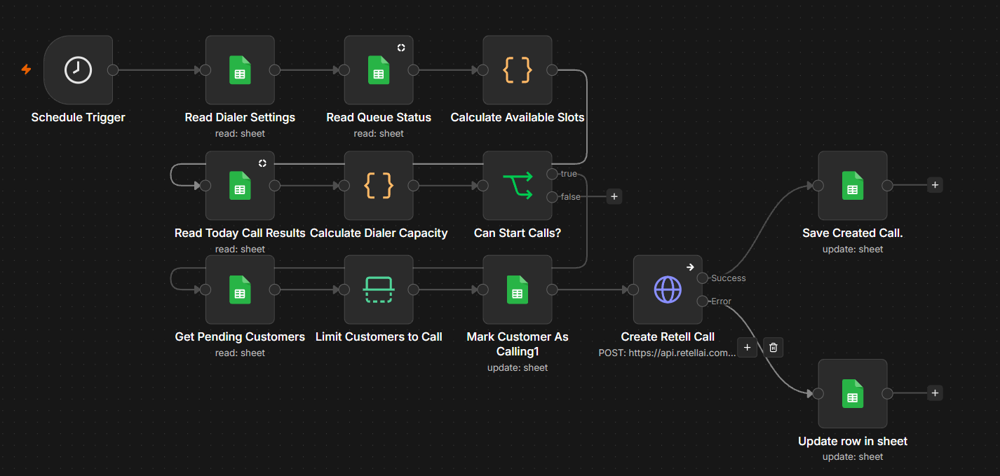
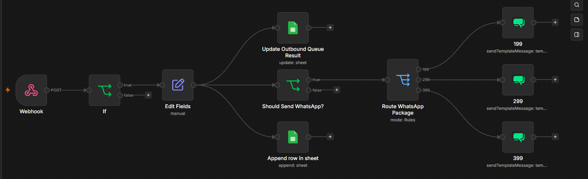

# ☎️ AI Voice Sales & Lead Prioritization System

An end-to-end AI-powered outbound sales system combining **Machine Learning**, **Voice AI**, and **n8n automation** to identify high-potential customers, prioritize sales opportunities, automatically initiate AI voice calls, analyze call outcomes, and trigger the appropriate next action.

The system connects predictive customer analytics with real-world sales execution through **Retell AI**, **n8n**, **Google Sheets**, and **WhatsApp/WATI**.

---

## 🚀 Project Overview

Traditional outbound calling often treats every customer equally.

This project introduces an intelligent decision layer before the call happens.

Customer behavior is analyzed using Machine Learning to estimate return probability and generate customer segments, sales recommendations, and call priority scores.

The highest-priority customers are then passed into an automated AI voice calling pipeline.

After every call, the system processes the conversation outcome and automatically decides what should happen next.

```text
Customer Historical Data
        ↓
Machine Learning
        ↓
Return Probability
        ↓
Customer Segmentation
        ↓
Marketing Recommendation
        ↓
Lead Priority Score
        ↓
Outbound Call Queue
        ↓
n8n Dialer Orchestration
        ↓
Retell AI Voice Agent
        ↓
Customer Conversation
        ↓
Post-Call Analysis
        ↓
Automatic Next Action
```

---

# 🧠 Machine Learning Layer

The Machine Learning layer analyzes historical customer behavior and predicts whether a customer is likely to return within **30 days**.

The pipeline includes:

- Data cleaning
- Order-level feature engineering
- Customer historical behavior features
- Financial behavior analysis
- Product and service usage features
- 30-day customer return prediction
- Customer risk segmentation
- Customer value segmentation
- Frequency segmentation
- Inactivity segmentation
- Marketing targeting logic
- Package recommendation
- Call eligibility logic
- Lead scoring
- Call priority ranking
- Dynamic AI voice call briefs

---

## 📊 Model

**Algorithm:** Random Forest Classifier

The model was evaluated using a **time-based validation split** to better simulate future customer behavior.

### Model Performance

| Metric | Score |
|---|---:|
| Accuracy | 81.7% |
| ROC-AUC | 0.881 |
| Precision | 0.847 |
| Recall | 0.887 |
| F1 Score | 0.867 |

The model outputs a customer-level return probability which becomes one of the signals used by the targeting and calling layers.

---

## 🎯 Lead Prioritization

Prediction alone is not enough.

The system converts Machine Learning results into actionable sales decisions.

Each customer can be evaluated using signals such as:

```text
Return Probability
        +
Customer Value
        +
Purchase Frequency
        +
Inactivity
        +
Recent Behavior
        +
Package Eligibility
        +
Sales Opportunity
        ↓
Call Priority Score
```

The final output determines:

- Whether the customer should be called
- How important the customer is
- The recommended sales objective
- The recommended offer
- Why the offer is suitable
- The preferred sales angle
- The AI voice agent's dynamic call brief

This allows the calling system to focus on higher-value opportunities instead of randomly contacting customers.

---

# ☎️ Outbound AI Calling System

The outbound calling workflow controls how and when AI calls are created.

It does more than simply trigger a phone call.

The workflow manages:

- Dialer enable / disable state
- Maximum concurrent calls
- Currently active calls
- Available calling capacity
- Daily call limits
- Calling hours
- Pending customer queue
- Call attempt tracking
- Customer selection
- Retell AI call creation
- Call ID tracking
- Failure handling
- Queue status updates

---

## ⚙️ Dialer Capacity Logic

Before starting a call, the workflow checks whether calling is currently allowed.

```text
Scheduled Trigger
        ↓
Read Dialer Settings
        ↓
Check Active Calls
        ↓
Calculate Available Slots
        ↓
Check Daily Call Limit
        ↓
Check Calling Hours
        ↓
Calls Allowed?
        ↓
Get Pending Customers
        ↓
Limit Customers to Available Capacity
        ↓
Create Retell AI Calls
```

This prevents the automation from exceeding configured operational limits.

---

## 🤖 Dynamic Retell AI Calls

Each selected customer is sent to the Retell AI voice agent with dynamic context.

The voice agent can receive information such as:

- Customer reference
- Call objective
- Recommended offer
- Recommendation reason
- Sales angle

Example architecture:

```text
Lead Prioritization
        ↓
Outbound Queue
        ↓
n8n
        ↓
Dynamic Customer Context
        ↓
Retell AI
        ↓
AI Voice Sales Conversation
```

The Voice AI agent therefore receives context generated from customer behavior instead of conducting a generic sales call.

---

# 🔄 Post-Call Automation

After the conversation finishes, Retell sends a call analysis event back to n8n.

The post-call workflow extracts and processes information such as:

- Call outcome
- Call status
- Call summary
- Customer sentiment
- Selected offer
- Callback request
- Rejection reason
- Voicemail detection
- Call duration
- Transcript
- Call success status
- WhatsApp follow-up request

---

## 🧠 Call Outcome Processing

```text
Retell Call Ends
        ↓
Call Analyzed Event
        ↓
n8n Webhook
        ↓
Extract Call Analysis
        ↓
Update Call Result
        ↓
Update Customer Queue
        ↓
Determine Next Action
```

Possible outcomes can include:

```text
Interested
        ↓
Continue Sales Follow-Up
```

```text
Callback Requested
        ↓
Store Callback Information
```

```text
Not Interested
        ↓
Update Customer State
```

```text
Call Failed / Voicemail
        ↓
Update Calling Status
```

---

# 💬 Automatic WhatsApp Follow-Up

One of the key post-call capabilities is automatic WhatsApp follow-up.

If the customer asks the Voice AI agent to send offer details through WhatsApp, the system detects the request after the call.

```text
Customer Requests WhatsApp Details
        ↓
Retell Call Analysis
        ↓
whatsapp_requested = true
        ↓
Identify Requested Offer
        ↓
Route Follow-Up
        ↓
Send WhatsApp Message
```

The post-call workflow routes the customer to the appropriate message automatically using **WATI**.

This creates a seamless transition from:

**Voice Conversation → Messaging Follow-Up**

without requiring manual intervention.

---

# 🏗️ Complete System Architecture

```text
                    CUSTOMER DATA
                          │
                          ▼
                ┌──────────────────┐
                │ Machine Learning │
                └────────┬─────────┘
                         │
                         ▼
                Return Probability
                         │
                         ▼
               Customer Segmentation
                         │
                         ▼
                Marketing Targeting
                         │
                         ▼
                Lead Prioritization
                         │
                         ▼
                Outbound Call Queue
                         │
                         ▼
                ┌──────────────────┐
                │       n8n        │
                │ Dialer Controller│
                └────────┬─────────┘
                         │
                         ▼
                  Retell AI Voice
                         │
                         ▼
                  Customer Call
                         │
                         ▼
                Retell Call Analysis
                         │
                         ▼
                ┌──────────────────┐
                │       n8n        │
                │ Post-Call Logic  │
                └────────┬─────────┘
                         │
           ┌─────────────┼─────────────┐
           │             │             │
           ▼             ▼             ▼
      WhatsApp       Callback      Update Sales
      Follow-Up       Request          State
```

---

# 🖼️ Workflow Screenshots

## Outbound AI Call Workflow



The outbound workflow manages dialer capacity, daily limits, calling windows, customer queue selection, Retell AI call creation, call tracking, and error handling.

---

## Post-Call Automation Workflow



The post-call workflow processes Retell call analysis, records call results, updates customer state, detects WhatsApp requests, and automatically routes the correct follow-up action.

---

# 🛠️ Tech Stack

### Artificial Intelligence & Machine Learning

- Python
- Pandas
- NumPy
- Scikit-learn
- Random Forest
- Predictive Modeling
- Feature Engineering
- Customer Segmentation
- Lead Scoring

### Voice AI

- Retell AI
- Dynamic Voice Agent Variables
- Call Analysis
- Conversation Transcripts
- Voice Sales Automation

### Automation

- n8n
- Webhooks
- REST APIs
- Scheduled Workflows
- Conditional Routing
- Automated Queue Management

### Messaging

- WhatsApp
- WATI
- Automated Template Messaging

### Data

- Google Sheets
- Customer behavioral features
- Outbound call queue
- Call-result tracking

---

# 📂 Repository Structure

```text
AI-Voice-Sales-Lead-Prioritization-System/
│
├── README.md
│
├── workflows/
│   ├── outbound-ai-call.json
│   └── post-call-automation.json
│
├── machine-learning/
│   ├── README.md
│   ├── customer-return-prediction-and-lead-prioritization.ipynb
│   └── requirements.txt
│
└── screenshots/
    ├── outbound-call-workflow.png
    └── post-call-workflow.png
```

---

# 📁 Repository Files

### `workflows/outbound-ai-call.json`

n8n workflow responsible for controlling outbound call capacity, selecting eligible customers, enforcing call limits, creating Retell AI calls, tracking call IDs, and updating outbound queue status.

### `workflows/post-call-automation.json`

n8n workflow responsible for processing Retell call analysis events, extracting conversation outcomes, updating customer and call status, and triggering WhatsApp follow-up when requested.

### `machine-learning/customer-return-prediction-and-lead-prioritization.ipynb`

Machine Learning pipeline responsible for customer return prediction, feature engineering, behavioral segmentation, marketing targeting, package recommendation, lead scoring, and outbound call prioritization.

### `machine-learning/requirements.txt`

Python dependencies required by the Machine Learning notebook.

### `machine-learning/README.md`

Technical documentation for the Machine Learning and lead-prioritization layer.

---

# 🔐 Security & Privacy

The files in this repository are **portfolio-safe versions** of a production-oriented system.

The public version intentionally excludes or anonymizes:

- API keys
- Authentication tokens
- Retell credentials
- WATI credentials
- Google credentials
- Private Sheet IDs
- Production phone numbers
- Customer phone numbers
- Customer identifiers
- Production datasets
- Internal company identifiers
- Private operational endpoints

The repository demonstrates the architecture, Machine Learning approach, automation logic, and AI orchestration without exposing confidential production information.

---

# 🎯 Project Goal

The goal of this project is to connect predictive Machine Learning directly with real-world AI sales execution.

Instead of:

```text
Call Everyone
```

the system follows:

```text
Predict
   ↓
Segment
   ↓
Prioritize
   ↓
Select
   ↓
Call
   ↓
Understand
   ↓
Follow Up
   ↓
Convert
```

The result is an end-to-end AI sales pipeline where **data decides who should be contacted, Voice AI handles the conversation, and automation manages what happens next.**

---

### Built by Yahya Zakaria

**AI Specialist | AI Agents | n8n Automation | Machine Learning**
